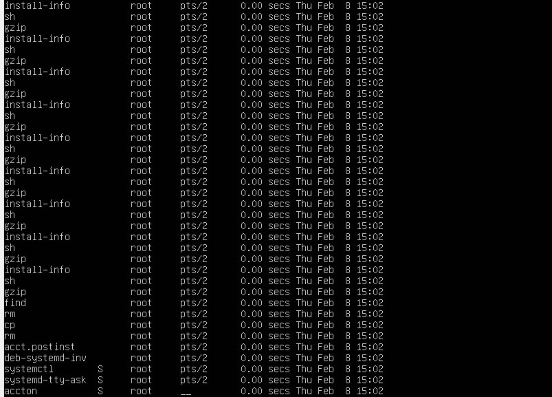
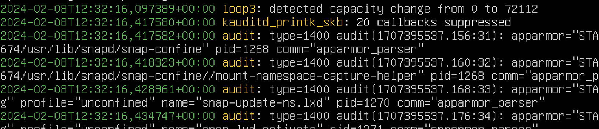
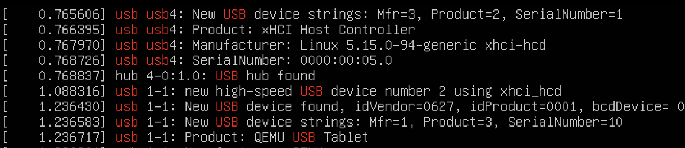
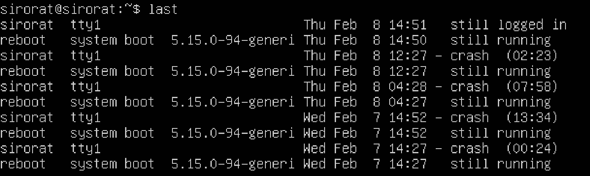

<!-- <h3>Journalctl<br></h3>
<p>Journalctl  คือ คำสั่งในการที่เรียกดูบันทึกเหตุการณ์ทั้งหมดภายในระบบ  ซึ่งเป็นบันทึกกระบวนการต่างๆ คือ กระบวนการบูตก่อนหน้า, เคอร์เนล, initrd และข้อผิดพลาดของแอปพลิเคชัน ในรูปแบบไบนารี่</p> -->
<!-- tail,grep,rsyslog,logrotate,Grep,Awk,Logstash,Splunk -->
# kuy

# lastcomm
lastcomm เป็นคำสั่งที่ใช้แสดงประวัติการใช้งานของผู้ใช้ ที่บันทึกไว้ใน /var/account/pacct การเเสดงผลจะเรียงตามเวลาล่าสุดที่ทำงานไปก่อนหน้านั้น


การใช้คำสั่ง lastcomm ต้องติดตั้งแพ็กเกจ acct โดยใช้

<code>sudo apt update</code>

<code>sudo apt install acct</code>

เพราะ acct ช่วยในการบันทึกข้อมูลเหล่านี้ไว้ เป็นไฟล์ log โดยที่  log พวกนี้อยู่ใน /var/log/account/pacct หรือ /var/account/pacct


ข้อมูลที่ lastcomm เเสดง คือ
- ชื่อคำสั่ง
- สถานะและการทำงานของกระบวนการ (Flags) <br>
  ลักษณะของ flags มีดังนี้
  - '<': แสดงว่ากระบวนการทำงานนี้มีการอ่านจากไฟล์
  - '>': แสดงว่ากระบวนการทำงานนี้มีการเขียนลงไปในไฟล์
  - 'C': กระบวนการทำงานเป็นของการควบคุมการเข้าถึงข้อมูล (Control process)
  - 'E': กระบวนการทำงานเป็นของระบบการส่งออก
  - 'X': แสดงว่ากระบวนการทำงานถูกติดตั้งเป็น setgid (set group ID)
  - '+' (คำนำหน้า): แสดงว่าโปรแกรมนี้ถูกตรวจสอบสิทธิ์บนเครื่อง
  - 'S': กระบวนการทำงานอยู่ในสถานะพร้อมทำงาน
  - 'D': กระบวนการทำงานอยู่ในสถานะพักการทำงาน (uninterruptible sleep)
  - 'R': กระบวนการทำงานอยู่ในสถานะรอการรัน<br>
  - 'Z': กระบวนการทำงานเป็น zombie <br>
<li>ชื่อผู้ใช้งาน</li>
<li>หมายเลข PID (Process ID)</li>
<li>เวลาที่กระบวนการเริ่มต้น-จบ</li>




## คำสั่ง lastcomm [option]
<table>
  <tr>
    <th>Option</th>
    <th>Description</th>
    <th>Examples</th>
  </tr>
  <tr>
    <td><code>-c</code></td>
    <td>แสดงชื่อของคำสั่งที่ใช้งาน</td>
    <td><code>lastcomm -c</code></td>
  </tr>
  <tr>
    <td><code>-d</code></td>
    <td>แสดงรายการที่ใช้งานในวันที่ระบุ</td>
    <td><code>lastcomm -d "2024-02-07"</code></td>
  </tr>
  <tr>
    <td><code>-f</code></td>
    <td>แสดงข้อมูลทั้งหมดที่มีอยู่</td>
    <td><code>lastcomm -f</code></td>
  </tr>
  <tr>
    <td><code>-h</code></td>
    <td>ซ่อนส่วนหัวของผลลัพธ์</td>
    <td><code>lastcomm -h</code></td>
  </tr>
  <tr>
    <td><code>-l</code></td>
    <td>แสดงข้อมูลเพิ่มเติมเกี่ยวกับโปรเซส เช่น uid, gid, tty, Nice value และ flags</td>
    <td><code>lastcomm -l</code></td>
  </tr>
  <tr>
    <td><code>-m</code></td>
    <td>รายงานโปรเซสที่มีการสร้างโดย crontab</td>
    <td><code>lastcomm -m</code></td>
  </tr>
  <tr>
    <td><code>-r</code></td>
    <td>แสดงผลลัพธ์ในลำดับย้อนหลัง</td>
    <td><code>lastcomm -r</code></td>
  </tr>
  <tr>
    <td><code>-s</code></td>
    <td>แสดงรายการของคำสั่งที่ระบุเวลา</td>
    <td><code>lastcomm -s "08:00" -s "17:00"</code></td>
  </tr>
  <tr>
    <td><code>-t</code></td>
    <td>แสดงรายการของคำสั่งที่ระบุเท่านั้น</td>
    <td><code>lastcomm -t "bash"</code></td>
  </tr>
  <tr>
    <td><code>-u</code></td>
    <td>ระบุผู้ใช้งานที่ต้องการให้แสดงผล</td>
    <td><code>lastcomm -u "username"</code></td>
  </tr>
</table>

>Option ที่น่าสนใจ


# dmesg
Demgs คือคำสั่งที่ใช้เพื่อแสดงข้อมูลจาก kernel ring buffer ซึ่งเป็นพื้นที่ในหน่วยความจำที่ใช้เก็บข้อมูลเกี่ยวกับเหตุการณ์ต่าง ๆ ที่เกิดขึ้นในระบบเมื่อระบบทำงาน รวมถึงข้อผิดพลาด (errors) และข้อความแจ้งเตือน (warnings) ต่าง ๆ ที่อาจเกิดขึ้นในเวลาที่ระบบเปิดใช้งานหรือในระหว่างการทำงาน<br>
## คำสั่ง dmesg [option]
<table>
    <tr>
        <th>Option</th>
        <th>Description</th>
        <th>Examples</th>
    </tr>
    <tr>
        <td><code>-C, --clear</code></td>
        <td>เคลียร์ kernel ring buffer</td>
        <td><code>dmesg -C</code></td>
    </tr>
     <tr>
    <td><code>-c, –read-clear</code></td>
    <td>เคลียร์ kernel ring buffer หลังข้อมูลถูกแสดง</td>
    <td><code>dmesg -c</code></td>
  </tr>
  <tr>
    <td><code>-f, –facility</code></td>
    <td>แสดงผลเฉพาะรายการของสิ่งที่ระบุไว้ในรายการหน่วยงานที่คั่นด้วยเครื่องหมายจุลภาค เช่น kern,user,syslog</td>
    <td><code>dmesg -f syslog</code></td>
  </tr>
  <tr>
    <td><code>-H, –human</code></td>
    <td>แสดงข้อมูลในรูปแบบของ HTML</td>
    <td><code>dmesg -H</code></td>
  </tr>
  <tr>
    <td><code>-L, --color[=auto|never|always]</code></td>
    <td>กำหนดการใช้สีในผลลัพธ์ที่แสดงผล</td>
    <td><code>dmesg –color=auto</code></td>
  </tr>
  <tr>
    <td><code>-l, –level</code></td>
    <td>เข้าถึงบันทึกตามที่ระบุลักษณะความสำคัญของข้อความ เช่น info,err,debug</td>
    <td><code>dmesg -l info</code></td>
  </tr>
  <tr>
    <td><code>--noescape</code></td>
    <td>ปิดใช้ละเว้นตัวอักษรที่ไม่สามารถพิมพ์ได้และอาจเป็นอันตรายได้โดยอัตโนมัติ เช่น ตัวอักษรควบคุม terminal</td>
    <td><code>dmesg --noescape</code></td>
  </tr>
  <tr>
    <td><code>-s, --buffer-size [size]</code></td>
    <td>กำหนดขนาดของ Buffer ขนาดเริ่มต้นคือ 16392</td>
    <td><code>dmesg -s 8192</code></td>
  </tr>
  <tr>
    <td><code>-T, --ctime</code></td>
    <td>แสดง timestamps ที่มนุษย์สามารถอ่านได้</td>
    <td><code>dmesg -T</code></td>
  </tr>
  <tr>
    <td><code>-t, --notime</code></td>
    <td>ไม่แสดง timestamps ของ kernel</td>
    <td><code>dmesg -t</code></td>
  </tr>
  <tr>
    <td><code>--time-format [format]</code></td>
    <td>แสดง timestamps โดยใช้ format เช่น iso,ctime</td>
    <td><code>dmesg –time-format=iso</code></td>
  </tr>
  <tr>
    <td><code>-w, --follow</code></td>
    <td>ติดตามการอัปเดตข้อมูลใหม่ที่ถูกเขียนลงใน buffer อย่างต่อเนื่อง</td>
    <td><code>dmesg -w</code></td>
  </tr>
</table>

>ข้อมูลเพิ่มเติม
- dmesg
    - แสดงผลลัพธ์จากคำสั่ง dmesg ทั้งหมด
- dmesg | less
    - จะแสดงผลลัพธ์จากคำสั่ง dmesg ในหน้าจอที่สามารถเลื่อนได้
- dmesg | grep -i pattern
    - ใช้สำหรับกรองข้อความที่ตรงกับ pattern ที่กำหนด เช่น dmesg | grep -i usb
> code examples
```cmd
  sudo dmesg --time-format=iso
```
แสดงเหตุการณ์ทั้งหมดที่เกิดขึ้นในระบบพร้อมกับเวลาในรูปแบบ ISO 8601 


```cmd
  sudo - dmesg | grep -i usb
```
แสดงเฉพาะบรรทัดในผลลัพธ์ของคำสั่ง dmesg ที่มีคำว่า "usb" โดยไม่คำนึงถึง case-insensitive


<br>

# last
แสดงรายการของผู้ใช้ที่เข้าสู่ระบบล่าสุด รวมถึงเวลาที่เข้าและออกไปด้วย โดยมักจะแสดงในรูปแบบตารางที่แสดงชื่อผู้ใช้, อุปกรณ์ที่ใช้เข้าสู่ระบบ, ที่อยู่ IP, เวลาที่เข้าและออกจากระบบ, และระยะเวลาการใช้งาน การใช้คำสั่ง "last" สามารถช่วยในการตรวจสอบข้อมูลเกี่ยวกับการเข้าสู่ระบบ
## คำสั่ง last [arguments] [parameters]
<table>
  <tr>
    <th>Option</th>
    <th>Describe</th>
    <th>Examples</th>
  </tr>
  <tr>
    <td><code>-n, --lines N</code></td>
    <td>กำหนดจำนวนบรรทัดที่แสดง</td>
    <td><code>last -n 10</code></td>
  </tr>
  <tr>
    <td><code>-f, --file FILE</code></td>
    <td>ระบุไฟล์บันทึกที่จะใช้</td>
    <td><code>last -f /var/log/lastlog</code></td>
  </tr>
  <tr>
    <td><code>-i, --ipaddress</code></td>
    <td>แสดงที่อยู่ IP ของผู้ใช้</td>
    <td><code>last -i</code></td>
  </tr>
  <tr>
    <td><code>-R, --reboot</code></td>
    <td>แสดงข้อมูลเกี่ยวกับการรีบูตของระบบ</td>
    <td><code>last -R</code></td>
  </tr>
  <tr>
    <td><code>-x, --details</code></td>
    <td>แสดงรายละเอียดเพิ่มเติมเกี่ยวกับการเข้าสู่ระบบ</td>
    <td><code>last -x</code></td>
  </tr>
</table>

>code examplems
```
last
```
<br>
1. แสดงชื่อของผู้ใช้ที่เข้าสู่ระบบ

2. ระบุว่าผู้ใช้เชื่อมต่อกับระบบอย่างไร เช่น ผ่าน pts (pseudo-terminal) หรือ tty (teletype) แต่ถ้ารีบูตจะแสดงว่า system boot.

3. แสดงที่มาของผู้ใช้ที่เข้าสู่ระบบ เช่น
- ชื่อโฮสต์หรือที่อยู่ IP - หากผู้ใช้เชื่อมต่อจากคอมพิวเตอร์ระยะไกล
- ค่าว่าง - หากผู้ใช้เชื่อมต่อผ่าน tty
- เวอร์ชันของเคอร์เนล - หากreboot
- ค่าที่เกี่ยวกับแอปพลิเคชันที่เฉพาะเจาะจง
4. แสดงเวลาที่กิจกรรมการเข้าสู่ระบบเกิดขึ้น

5. แสดงเวลาออกจากระบบ
- ค่าที่อาจพบได้คือ
    - ปัจจุบันเวลา - หากผู้ใช้ออกจากระบบ
    - still running - หากระบบกำลังเริ่มต้นอยู่
    - still logged in - หากผู้ใช้ยังคงเข้าสู่ระบบ
    - down - ระบบปิดการทำงานอย่างปกติ
    - qcrash - หากไม่มีรายการออกจากระบบในไฟล์ "/var/log/wtmp" โดยทั่วไปนี่หมายถึงว่าระบบล้มเหลว
# Grep

