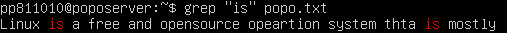

# Log reader & Analysis
Log reader & Analysis คือ การอ่านบันทึกข้อผิดพลาดหรือบันทึกข้อมูล และวิเคราะห์ข้อมูลที่บันทึกไว้ใน log files ของ linux โดย log ที่บันทึกไว้อาจเป็นข้อมูลเกี่ยวกับเหตุการณ์ที่เกิดขึ้นในระบบ เช่น บันทึกการเข้าสู่ระบบ, การเปิดและปิดเซสชัน, การเข้าถึงไฟล์, ข้อผิดพลาดในระบบ เช่น grep, tail, awk, sed

# dmesg
Demgs คือคำสั่งที่ใช้เพื่อแสดงข้อมูลจาก kernel ring buffer ซึ่งเป็นพื้นที่ในหน่วยความจำที่ใช้เก็บข้อมูลเกี่ยวกับเหตุการณ์ต่าง ๆ ที่เกิดขึ้นในระบบเมื่อระบบทำงาน รวมถึงข้อผิดพลาด (errors) และข้อความแจ้งเตือน (warnings) ต่าง ๆ ที่อาจเกิดขึ้นในเวลาที่ระบบเปิดใช้งานหรือในระหว่างการทำงาน[1]<br>
## คำสั่ง dmesg [option][1]
<table>
    <tr>
        <th>Option</th>
        <th>Description</th>
        <th>Examples</th>
    </tr>
    <tr>
        <td><code>-C, --clear</code></td>
        <td>เคลียร์ kernel ring buffer</td>
        <td><code>dmesg -C</code></td>
    </tr>
     <tr>
    <td><code>-c, –read-clear</code></td>
    <td>เคลียร์ kernel ring buffer หลังข้อมูลถูกแสดง</td>
    <td><code>dmesg -c</code></td>
  </tr>
  <tr>
    <td><code>-f, –facility</code></td>
    <td>แสดงผลเฉพาะรายการของสิ่งที่ระบุไว้ในรายการหน่วยงานที่คั่นด้วยเครื่องหมายจุลภาค เช่น kern,user,syslog</td>
    <td><code>dmesg -f syslog</code></td>
  </tr>
  <tr>
    <td><code>-H, –human</code></td>
    <td>แสดงข้อมูลในรูปแบบของ HTML</td>
    <td><code>dmesg -H</code></td>
  </tr>
  <tr>
    <td><code>-L, --color[=auto|never|always]</code></td>
    <td>กำหนดการใช้สีในผลลัพธ์ที่แสดงผล</td>
    <td><code>dmesg –color=auto</code></td>
  </tr>
  <tr>
    <td><code>-l, –level</code></td>
    <td>เข้าถึงบันทึกตามที่ระบุลักษณะความสำคัญของข้อความ เช่น info,err,debug</td>
    <td><code>dmesg -l info</code></td>
  </tr>
  <tr>
    <td><code>--noescape</code></td>
    <td>ปิดใช้ละเว้นตัวอักษรที่ไม่สามารถพิมพ์ได้และอาจเป็นอันตรายได้โดยอัตโนมัติ เช่น ตัวอักษรควบคุม terminal</td>
    <td><code>dmesg --noescape</code></td>
  </tr>
  <tr>
    <td><code>-s, --buffer-size [size]</code></td>
    <td>กำหนดขนาดของ Buffer ขนาดเริ่มต้นคือ 16392</td>
    <td><code>dmesg -s 8192</code></td>
  </tr>
  <tr>
    <td><code>-T, --ctime</code></td>
    <td>แสดง timestamps ที่มนุษย์สามารถอ่านได้</td>
    <td><code>dmesg -T</code></td>
  </tr>
  <tr>
    <td><code>-t, --notime</code></td>
    <td>ไม่แสดง timestamps ของ kernel</td>
    <td><code>dmesg -t</code></td>
  </tr>
  <tr>
    <td><code>--time-format [format]</code></td>
    <td>แสดง timestamps โดยใช้ format เช่น iso,ctime</td>
    <td><code>dmesg –time-format=iso</code></td>
  </tr>
  <tr>
    <td><code>-w, --follow</code></td>
    <td>ติดตามการอัปเดตข้อมูลใหม่ที่ถูกเขียนลงใน buffer อย่างต่อเนื่อง</td>
    <td><code>dmesg -w</code></td>
  </tr>
</table>

>ข้อมูลเพิ่มเติม
- dmesg
    - แสดงผลลัพธ์จากคำสั่ง dmesg ทั้งหมด
- dmesg | less
    - จะแสดงผลลัพธ์จากคำสั่ง dmesg ในหน้าจอที่สามารถเลื่อนได้
- dmesg | grep -i pattern
    - ใช้สำหรับกรองข้อความที่ตรงกับ pattern ที่กำหนด เช่น dmesg | grep -i usb
> code examples
```cmd
  sudo dmesg --time-format=iso
```
แสดงเหตุการณ์ทั้งหมดที่เกิดขึ้นในระบบพร้อมกับเวลาในรูปแบบ ISO 8601 


```cmd
  sudo - dmesg | grep -i usb
```
แสดงเฉพาะบรรทัดในผลลัพธ์ของคำสั่ง dmesg ที่มีคำว่า "usb" โดยไม่คำนึงถึง case-insensitive


<br>

# last
แสดงรายการของผู้ใช้ที่เข้าสู่ระบบล่าสุด รวมถึงเวลาที่เข้าและออกไปด้วย โดยมักจะแสดงในรูปแบบตารางที่แสดงชื่อผู้ใช้, อุปกรณ์ที่ใช้เข้าสู่ระบบ, ที่อยู่ IP, เวลาที่เข้าและออกจากระบบ, และระยะเวลาการใช้งาน การใช้คำสั่ง "last" สามารถช่วยในการตรวจสอบข้อมูลเกี่ยวกับการเข้าสู่ระบบ[2]
## คำสั่ง last [arguments] [parameters][2]
<table>
  <tr>
    <th>Option</th>
    <th>Description</th>
    <th>Examples</th>
  </tr>
  <tr>
    <td><code>-n, --lines N</code></td>
    <td>กำหนดจำนวนบรรทัดที่แสดง</td>
    <td><code>last -n 10</code></td>
  </tr>
  <tr>
    <td><code>-f, --file FILE</code></td>
    <td>ระบุไฟล์บันทึกที่จะใช้</td>
    <td><code>last -f /var/log/lastlog</code></td>
  </tr>
  <tr>
    <td><code>-i, --ipaddress</code></td>
    <td>แสดงที่อยู่ IP ของผู้ใช้</td>
    <td><code>last -i</code></td>
  </tr>
  <tr>
    <td><code>-R, --reboot</code></td>
    <td>แสดงข้อมูลเกี่ยวกับการรีบูตของระบบ</td>
    <td><code>last -R</code></td>
  </tr>
  <tr>
    <td><code>-x, --details</code></td>
    <td>แสดงรายละเอียดเพิ่มเติมเกี่ยวกับการเข้าสู่ระบบ</td>
    <td><code>last -x</code></td>
  </tr>
</table>

>code examplems
```
last
```
<br>
1. แสดงชื่อของผู้ใช้ที่เข้าสู่ระบบ[3]

2. ระบุว่าผู้ใช้เชื่อมต่อกับระบบอย่างไร เช่น ผ่าน pts (pseudo-terminal) หรือ tty (teletype) แต่ถ้ารีบูตจะแสดงว่า system boot.[3]

3. แสดงที่มาของผู้ใช้ที่เข้าสู่ระบบ[3] เช่น
    - ชื่อโฮสต์หรือที่อยู่ IP - หากผู้ใช้เชื่อมต่อจากคอมพิวเตอร์ระยะไกล
    - ค่าว่าง - หากผู้ใช้เชื่อมต่อผ่าน tty
    - เวอร์ชันของเคอร์เนล - หากreboot
    - ค่าที่เกี่ยวกับแอปพลิเคชันที่เฉพาะเจาะจง
4. แสดงเวลาที่กิจกรรมการเข้าสู่ระบบเกิดขึ้น[3]

5. แสดงเวลาออกจากระบบ[3]
    - ค่าที่อาจพบได้คือ
        - ปัจจุบันเวลา - หากผู้ใช้ออกจากระบบ
        - still running - หากระบบกำลังเริ่มต้นอยู่
        - still logged in - หากผู้ใช้ยังคงเข้าสู่ระบบ
        - down - ระบบปิดการทำงานอย่างปกติ
        - qcrash - หากไม่มีรายการออกจากระบบในไฟล์ "/var/log/wtmp" โดยทั่วไปนี่หมายถึงว่าระบบล้มเหลว
# Grep
ใช้สำหรับค้นหาข้อความในไฟล์ข้อความหรือไฟล์ข้อความที่ส่งเข้ามาผ่านทางคอมไพเลอร์ แล้วแสดงบรรทัดที่ตรงกับข้อความที่กำหนด[4]
## คำสั่ง grep [options] pattern [FILE][4]
<table>
<tr>
    <th>Option</th>
    <th>Description</th>
    <th>Examples</th>
  </tr>
  <tr>
    <td><code>-i</code></td>
    <td>ไม่สนใจตัวอักษรพิมพ์ใหญ่หรือเล็กใน pattern</td>
    <td><code>grep -i "pattern" filename</code></td>
  </tr>
  <tr>
    <td><code>-r</code></td>
    <td>อ่านไฟล์ทั้งหมดในแต่ละไดเรกทอรีและไดเรกทอรีย่อยๆ โดยอัตโนมัติ</td>
    <td><code>grep -r "pattern" directory</code></td>
  </tr>
  <tr>
    <td><code>-n</code></td>
    <td>เติมหมายเลขบรรทัดของแต่ละบรรทัดในไฟล์เข้าไปด้วย โดยนับจากบรรทัดแรกเป็นบรรทัดที่ 1</td>
    <td><code>grep -n "pattern" filename</code></td>
  </tr>
  <tr>
    <td><code>-v</code></td>
    <td>เลือกบรรทัดที่ไม่ตรงกับpattern</td>
    <td><code>grep -v "pattern" filename</code></td>
  </tr>
  <tr>
    <td><code>-E</code></td>
    <td>ใช้ regular expressions ขั้นสูง (รองรับ ?, +, {}, () เป็นต้น)</td>
    <td><code>grep -E "pattern" filename</code></td>
  </tr>
  <tr>
    <td><code>-w</code></td>
    <td>ตรงกับคำเท่านั้น</td>
    <td><code>grep -w "คำ" filename</code></td>
  </tr>
  <tr>
  <td><code>--color</code></td>
  <td>ทำให้ข้อความที่ตรงกับ pattern มีสีเน้น</td>
  <td><code>grep --color "pattern" filename</code></td>
  <tr>
    <td><code>-c</code></td>
    <td>นับจำนวนบรรทัดที่ตรงกับ pattern</td>
    <td><code>grep -c "pattern" filename</code></td>
   </tr>
  <tr>
    <td><code>-l</code></td>
    <td>แสดงเฉพาะชื่อไฟล์ที่มีข้อมูลที่ตรงกับ pattern</td>
    <td><code>grep -l "pattern" *.txt</code></td>
  </tr>
  <tr>
    <td><code>-f</code></td>
    <td>อ่าน patternจากไฟล์</td>
    <td><code>grep -f patterns.txt filename</code></td>
  </tr>
</table>

> code example
```c
grep -c "hello" xxx.txt
```
นับจำนวนบรรทัดที่ตรงกับ pattern

<br>

# awk
เป็นคำสั่งที่สามารถใช้แปลง, ค้นหา และ สร้างข้อมูลในรูปแบบ text ที่มีความซับซ้อนตามความต้องการของ user ได้ทุกรูปแบบ[5]
- Awk มักถูกใช้ในการดำเนินการต่างๆ กับข้อมูลข้อความ[6] เช่น
    1. การค้นหาและแสดงข้อมูลที่ตรงตามเงื่อนไขที่กำหนด
    2. การคำนวณค่าหรือการสร้างรายงานจากข้อมูล
    3. การแปลงรูปแบบของข้อมูล เช่น การเปลี่ยนรูปแบบของข้อมูลจากไฟล์ล็อกเข้ารหัสเป็นข้อความที่อ่านได้ง่าย
    4. การประมวลผลข้อมูลในรูปแบบของคอลัมน์และแถว
## คำสั่ง awk 'pattern { action }' input-file[7]
<table>
  <thead>
    <tr>
      <th>Action</th>
      <th>Description</th>
      <th>Examples</th>
    </tr>
  </thead>
  <tbody>
    <tr>
      <td>Print</td>
      <td>พิมพ์บรรทัดทั้งหมดที่ตรงกับเงื่อนไขที่กำหนด</td>
      <td><code>awk '/pattern/ { print }' input-file</code></td>
    </tr>
    <tr>
      <td>กำหนดค่า (Assignment)</td>
      <td>กำหนดค่าให้กับตัวแปรตามเงื่อนไขที่กำหนด</td>
      <td><code>awk '/pattern/ { var = $1 }' input-file</code></td>
    </tr>
    <tr>
      <td>เงื่อนไข (Conditional Statements)</td>
      <td>ทำตามเงื่อนไขที่กำหนด</td>
      <td><code>awk '/pattern/ { if ($1 > 10) print $0 }' input-file</code></td>
    </tr>
    <tr>
      <td>Looping</td>
      <td>ทำซ้ำๆ สำหรับแต่ละบรรทัด</td>
      <td><code>awk '{ for (i = 1; i <= NF; i++) print $i }' input-file</code></td>
    </tr>
    <tr>
      <td>BEGIN & END Blocks</td>
      <td>ทำการกระทำก่อนที่จะเริ่มการประมวลผลและหลังจากการประมวลผลสิ้นสุด</td>
      <td><code>awk 'BEGIN { print "เริ่มการประมวลผล" } /pattern/ { print $0 } END { print "การประมวลผลเสร็จสิ้น" }' input-file</code></td>
    </tr>
    <tr>
      <td>ฟังก์ชันที่มีอยู่ใน awk</td>
      <td>ฟังก์ชันที่ให้มาให้ใช้ในการประมวลผลข้อมูล</td>
      <td><code>awk '/pattern/ { len = length($1); print len }' input-file</code></td>
    </tr>
    <tr>
      <td>Arrays</td>
      <td>ใช้ในการจัดเก็บและประมวลผลข้อมูลในรูปแบบของอาร์เรย์</td>
      <td><code>awk '{ count[$1]++ } END { for (word in count) print word, count[word] }' input-file</code></td>
    </tr>
  </tbody>
</table>

>code examples[5]

ใช้ white space เป็นตัวแบ่งข้อมูล field ($) โดย field number จะเริ่มต้นที่ 1 แต่ถ้าจะให้แสดงผลทั้งหมดจะใช้ $0
```
awk '{print $0}' saixiii.txt
```
output
```
line,1,Hello world!
line,2,My name is saixiii
line,3,Good Bye
line,4,Bye
```

ใส่เงื่อนไขในการแสดงผล
```
awk -F',' '{if($2%2==1) {print $0}}' saixiii.txt
```
output
```
line,1,Hello world!
line,3,Good Bye
```

# sed
ใช้สำหรับแก้ไขและประมวลผลข้อมูลข้อความเป็นลำดับ โดยทำงานโดยอ่านข้อมูลจากแหล่งให้ได้ และส่งออกผลลัพธ์ไปยังอีกแหล่งหนึ่ง โดยจะทำการแก้ไขข้อมูลของแถวที่ตรงตามเงื่อนไขที่กำหนดไว้ หรือปฏิบัติการอื่น ๆ ตามคำสั่งที่ระบุ โดยการใช้งานผ่าน command line interface (CLI)[8]

## คำสั่ง sed [options] 'command' file[8]
<table>
  <tr>
    <th>Option</th>
    <th>Description</th>
    <th>Examples</th>
  </tr>
  <tr>
    <td><code>-n</code></td>
    <td>ป้องกันการพิมพ์โดยอัตโนมัติของสเปซแพทเทิร์น</td>
    <td><code>sed -n '1p' file.txt</code></td>
  </tr>
  <tr>
    <td><code>-i</code></td>
    <td>แก้ไขไฟล์ในที่ (ทำการสำรองไฟล์หากมีการระบุนามสกุล)</td>
    <td><code>sed -i.bak 's/old/new/' file.txt</code></td>
  </tr>
  <tr>
    <td><code>-e script</code></td>
    <td>เพิ่มสคริปต์ไปยังคำสั่งที่จะประมวลผล</td>
    <td><code>sed -e 's/old/new/' -e 's/foo/bar/' file.txt</code></td>
  </tr>
  <tr>
    <td><code>-r</code></td>
    <td>ช้ syntax ของ regular expression แบบขยาย</td>
    <td><code>sed -r 's/regex/replacement/' file.txt</code></td>
  </tr>
  <tr>
    <td><code>-f script-file</code></td>
    <td>เพิ่มเนื้อหาของไฟล์สคริปต์ไปยังคำสั่งที่จะประมวลผล</td>
    <td><code>sed -f script.sed file.txt</code></td>
  </tr>
  <tr>
    <td><code>-i.bak</code></td>
    <td>สำรองไฟล์เดิมด้วยนามสกุล .bak ก่อนที่จะแก้ไขในที่</td>
    <td><code>sed -i.bak 's/old/new/' file.txt</code></td>
  </tr>
  <tr>
    <td><code>-u</code></td>
    <td>เก็บข้อมูลเขียนจนกว่าจะมีการเกิดการขึ้นของบรรทัดในสเปซแพทเทิร์น</td>
    <td><code>sed -u 's/old/new/' file.txt</code></td>
  </tr>
  <tr>
    <td><code>-h</code></td>
    <td>ป้อนเอ็นทรี่ไปยังคำสั่ง sed โดยไม่ระบุชื่อไฟล์ที่อยู่ในหัวข้อ</td>
    <td><code>sed -n 's/old/new/' file.txt</code></td>
  </tr>
  <tr>
    <td><code>-V</code></td>
    <td>แสดงรายละเอียดเวอร์ชันของ sed</td>
    <td><code>sed -V</code></td>
  </tr>
</table>

>ข้อมูลเพิ่มเติม[8]

แทนที่ข้อความเก่าด้วยข้อความใหม่เฉพาะครั้งแรกที่พบในแต่ละบรรทัดของไฟล์
```
sed 's/old_string/new_string/' filename.txt
```
แทนที่ข้อความเก่าด้วยข้อความใหม่ทุกครั้งที่พบ โดยไม่จำกัดเพียงครั้งเดียวต่อบรรทัดเท่านั้น
```
sed 's/old_string/new_string/g' filename.txt
```
แทนที่ข้อความเก่าด้วยข้อความใหม่ในเฉพาะครั้งที่ #(1,2,..) ที่พบ

```
sed 's/old_string/new_string/#' filename.txt
```
แทนที่ข้อความในบรรทัดที่ i-j ตามที่กำหนด
```
sed 'i,j s/old_string/new_string/' filename.txt
```
ลบข้อความในบรรทัดที่กำหนด(# = number)
```
sed '#d' filename.txt
```
ลบข้อความในบรรทัดที่ i-j
```
sed 'i,jd' filename.txt
```
ลบเนื้อหาจากบรรทัดที่กำหนดจนถึงบรรทัดสุดท้ายของ file
```
sed '#,$d' filename.txt
```
# lastcomm
lastcomm เป็นคำสั่งที่ใช้แสดงประวัติการใช้งานของผู้ใช้ ที่บันทึกไว้ใน /var/account/pacct การเเสดงผลจะเรียงตามเวลาล่าสุดที่ทำงานไปก่อนหน้านั้น


การใช้คำสั่ง lastcomm ต้องติดตั้งแพ็กเกจ acct โดยใช้

<code>sudo apt update</code>

<code>sudo apt install acct</code>

เพราะ acct ช่วยในการบันทึกข้อมูลเหล่านี้ไว้ เป็นไฟล์ log โดยที่  log พวกนี้อยู่ใน /var/log/account/pacct หรือ /var/account/pacct


ข้อมูลที่ lastcomm เเสดง คือ
- ชื่อคำสั่ง
- สถานะและการทำงานของกระบวนการ (Flags) <br>
  ลักษณะของ flags มีดังนี้
  - '<': แสดงว่ากระบวนการทำงานนี้มีการอ่านจากไฟล์
  - '>': แสดงว่ากระบวนการทำงานนี้มีการเขียนลงไปในไฟล์
  - 'C': กระบวนการทำงานเป็นของการควบคุมการเข้าถึงข้อมูล (Control process)
  - 'E': กระบวนการทำงานเป็นของระบบการส่งออก
  - 'X': แสดงว่ากระบวนการทำงานถูกติดตั้งเป็น setgid (set group ID)
  - '+' (คำนำหน้า): แสดงว่าโปรแกรมนี้ถูกตรวจสอบสิทธิ์บนเครื่อง
  - 'S': กระบวนการทำงานอยู่ในสถานะพร้อมทำงาน
  - 'D': กระบวนการทำงานอยู่ในสถานะพักการทำงาน (uninterruptible sleep)
  - 'R': กระบวนการทำงานอยู่ในสถานะรอการรัน<br>
  - 'Z': กระบวนการทำงานเป็น zombie <br>
<li>ชื่อผู้ใช้งาน</li>
<li>หมายเลข PID (Process ID)</li>
<li>เวลาที่กระบวนการเริ่มต้น-จบ</li>


## คำสั่ง lastcomm [option]
>Option ที่น่าสนใจ
<table>
  <tr>
    <th>Option</th>
    <th>Description</th>
    <th>Examples</th>
  </tr>
  <tr>
    <td><code>-c</code></td>
    <td>แสดงชื่อของคำสั่งที่ใช้งาน</td>
    <td><code>lastcomm -c</code></td>
  </tr>
  <tr>
    <td><code>-d</code></td>
    <td>แสดงรายการที่ใช้งานในวันที่ระบุ</td>
    <td><code>lastcomm -d "2024-02-07"</code></td>
  </tr>
  <tr>
    <td><code>-f</code></td>
    <td>แสดงข้อมูลทั้งหมดที่มีอยู่</td>
    <td><code>lastcomm -f</code></td>
  </tr>
  <tr>
    <td><code>-h</code></td>
    <td>ซ่อนส่วนหัวของผลลัพธ์</td>
    <td><code>lastcomm -h</code></td>
  </tr>
  <tr>
    <td><code>-l</code></td>
    <td>แสดงข้อมูลเพิ่มเติมเกี่ยวกับโปรเซส เช่น uid, gid, tty, Nice value และ flags</td>
    <td><code>lastcomm -l</code></td>
  </tr>
  <tr>
    <td><code>-m</code></td>
    <td>รายงานโปรเซสที่มีการสร้างโดย crontab</td>
    <td><code>lastcomm -m</code></td>
  </tr>
  <tr>
    <td><code>-r</code></td>
    <td>แสดงผลลัพธ์ในลำดับย้อนหลัง</td>
    <td><code>lastcomm -r</code></td>
  </tr>
  <tr>
    <td><code>-s</code></td>
    <td>แสดงรายการของคำสั่งที่ระบุเวลา</td>
    <td><code>lastcomm -s "08:00" -s "17:00"</code></td>
  </tr>
  <tr>
    <td><code>-t</code></td>
    <td>แสดงรายการของคำสั่งที่ระบุเท่านั้น</td>
    <td><code>lastcomm -t "bash"</code></td>
  </tr>
  <tr>
    <td><code>-u</code></td>
    <td>ระบุผู้ใช้งานที่ต้องการให้แสดงผล</td>
    <td><code>lastcomm -u "username"</code></td>
  </tr>
</table>


>Reference

[1]https://phoenixnap.com/kb/dmesg-linux<br>
[2]https://ioflood.com/blog/last-linux-command/<br>
[3]https://www.baeldung.com/linux/last-command<br>
[4]https://www.hostinger.com/tutorials/grep-command-in-linux-useful-examples/<br>
[5]https://saixiii.com/awk-linux-command/<br>
[6]https://th.linux-console.net/?p=17513<br>
[7]https://linuxize.com/post/awk-command/<br>
[8]https://phoenixnap.com/kb/linux-sed